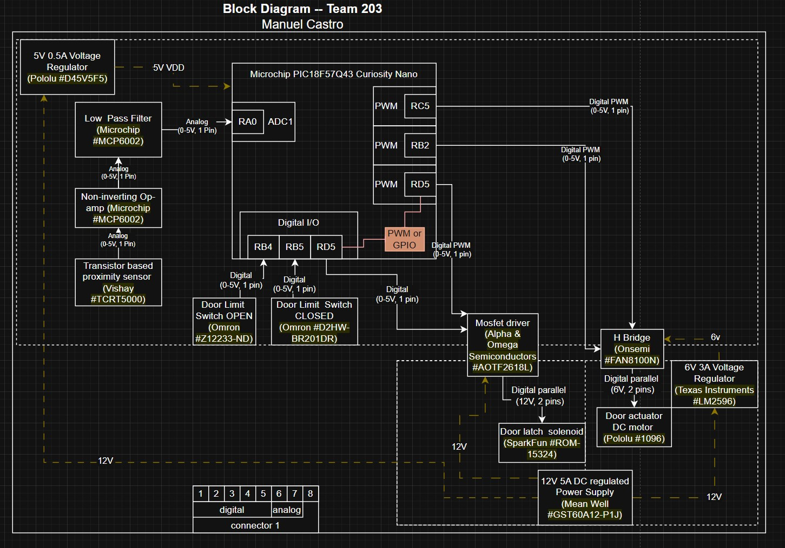

## Overview

The purpose of this diagram is to quickly visualize the scope of the prototype PCB I am building with all core functions. The diagram will show the power required for each component and what components will be supplying this power. The PCB is composed of a group of components chosen to help achieve motion detection, operate a gear driven DC motor, and secure the internal components with a solenoid operated door latch.
This needs to be updated with a brief purpose for having the block diagram. As you will note, there are no connections going in or out to other PIC boards. This is because my sensor does not need to communicate with other PIC's to function. 
Below are some bullet points with relevant informaiton: 
* Power
The components use power from three different sources. The main one being the 12V DC wall adapter plug, then two branching voltage regulators, one for 6V/3A and the other for 5V/0.5A. 
* Sensor
There is one transistor based analog sensor that will provide data to our PIC for use as our proximity sensor. 
* Actuator
Our geared DC motor will funciton as our actuator, this will operate our hinge mechanism for the opening and closing door. 

## Block Diagram 
Below is the block diagram for this project.

