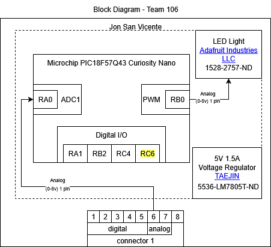

## Overview

The circuit will recieve a signal from a light sensor along pin 6 and based on the recieved signal, will toggle a light.
The circuit will run on 5v 1.5A  being supplied by a voltage regulator power supply.

## Block Diagram 

