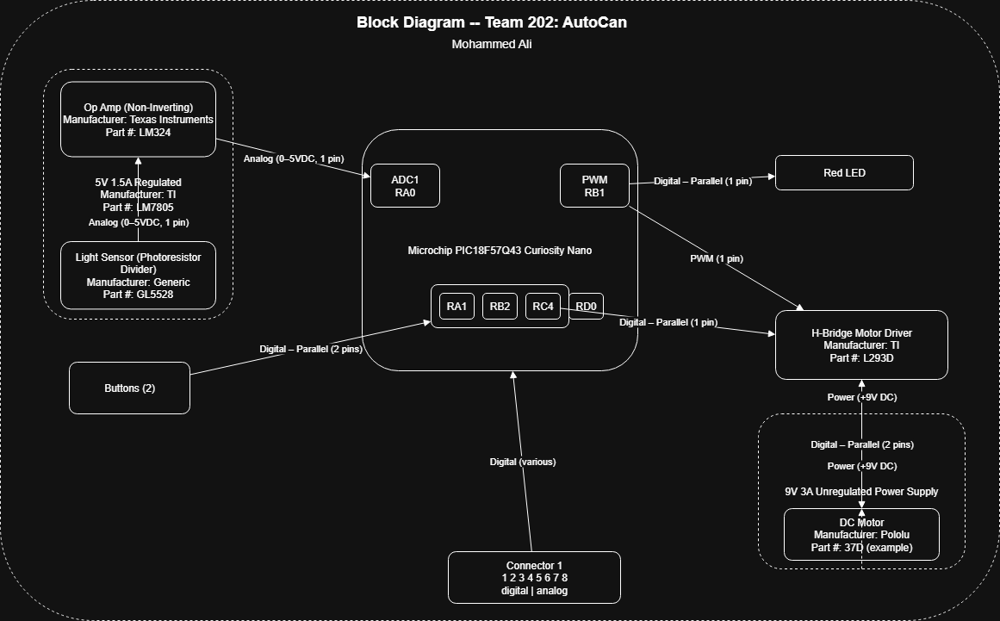

## Overview
Adrian’s subsystem for TechMinds’ automatic curtain raiser centers on a Microchip PIC18F57Q43 Curiosity Nano running on a 3.3 V regulated logic rail
(all I/O at 3.3 V; analog range 0–3.3 V) with a common GND shared through the class 8-pin ribbon. Sensor: a potentiometer sends an analog 0–3.3 V signal into 
RA0/ADC1, and Button 1 is a digital/parallel 3.3 V input to the Digital I/O block. Actuator: A red LED is driven by PWM on RC2 (3.3 V) for
brightness feedback. Team connections: the standardized 8-pin connector exposes this board’s signal pins 1-5 digital, pins 6–8 analog—and, 
per the team plan, Mihir’s hub board reads Adrian’s potentiometer (analog over pins 6–7) while Adrian keeps local digital (button/LED) to minimize 
cross-board dependencies; Zane’s DAC also feeds Mihir. Power source: This board assumes a regulated 3.3 V supply (from USB or a team regulator) for the 
MCU and LED, while any higher-voltage motor/H-bridge power is handled on Mihir’s board; only the necessary analog lines, plus a shared ground, 
cross the ribbon to keep wiring simple and noise levels low.

## Example Block Diagram 
Showing an example of how to import a screenshot of the block diagram created outside of git and brought into a page.

