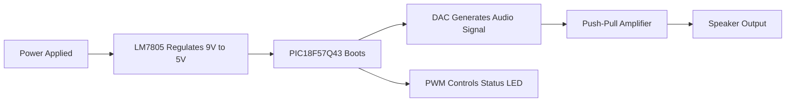
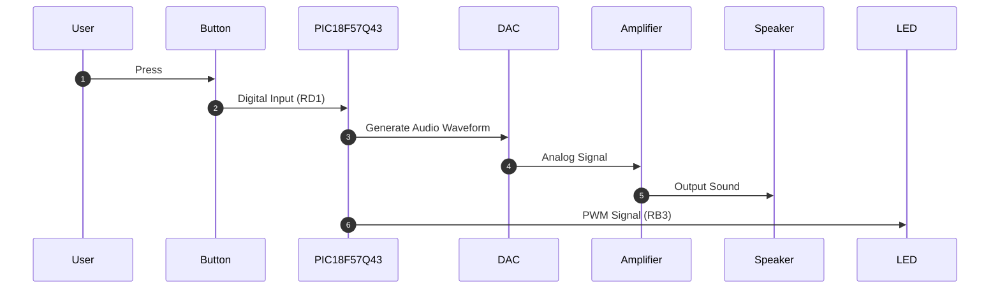
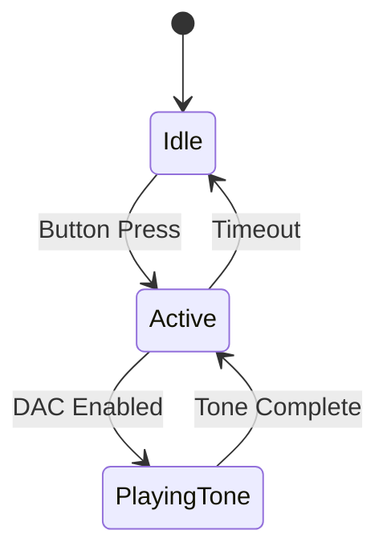
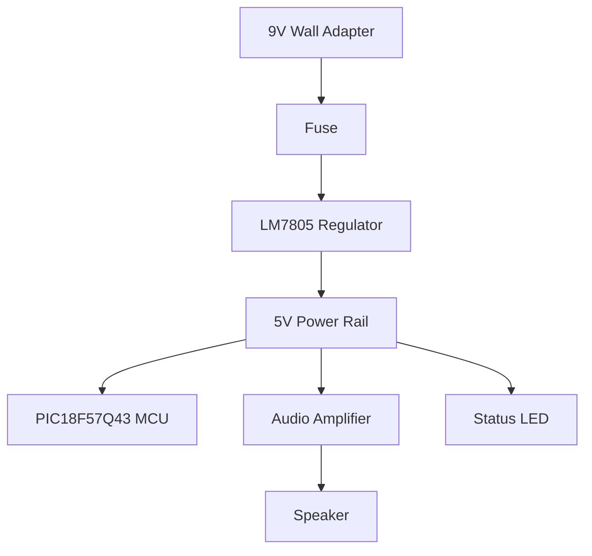

## System Flow Chart (Speaker Operation)

```mermaid
graph LR
    A[Power Applied] --> B[LM7805 Regulates 9V to 5V]
    B --> C[PIC18F57Q43 Boots]
    C --> D[DAC Generates Audio Signal]
    D --> E[Push-Pull Amplifier]
    E --> F[Speaker Output]
    C --> G[PWM Controls Status LED]

```

``` mermaid
sequenceDiagram
    autonumber
    User->>Button: Press
    Button->>PIC18F57Q43: Digital Input (RD1)
    PIC18F57Q43->>DAC: Generate Audio Waveform
    DAC->>Amplifier: Analog Signal
    Amplifier->>Speaker: Output Sound
    PIC18F57Q43->>LED: PWM Signal (RB3)

```

``` mermaid
stateDiagram-v2
    [*] --> Idle
    Idle --> Active: Button Press
    Active --> PlayingTone: DAC Enabled
    PlayingTone --> Active: Tone Complete
    Active --> Idle: Timeout

```

``` mermaid
graph TD
    A[9V Wall Adapter] --> B[Fuse]
    B --> C[LM7805 Regulator]
    C --> D[5V Power Rail]
    D --> E[PIC18F57Q43 MCU]
    D --> F[Audio Amplifier]
    D --> G[Status LED]
    F --> H[Speaker]
```
